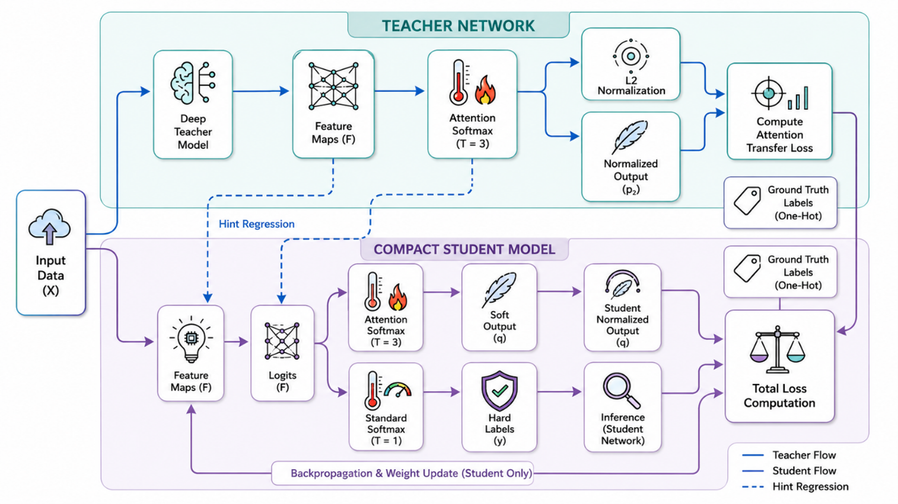
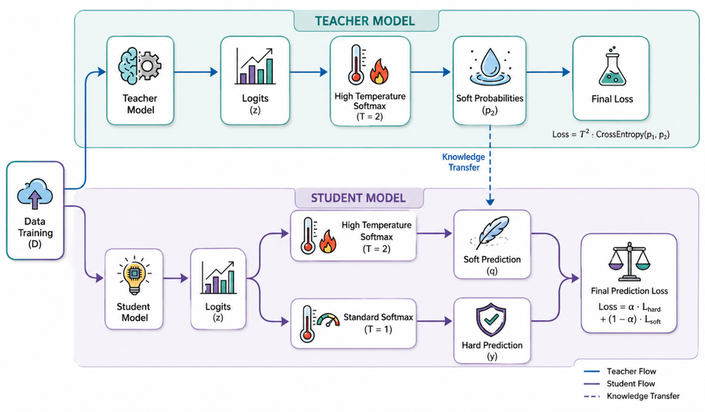

# AT-KD

Minimal reference implementation of **Attention Transfer Knowledge Distillation (AT-KD)**
applied to blood-cell / acute lymphoblastic leukemia (ALL) image classification.

This repository accompanies the AT-KD paper and is the smallest self-contained code base
needed to reproduce its main result table.

---

## Architecture



The student receives three supervision signals:

1. **Cross-entropy** against the ground-truth label.
2. **KL divergence** between softmax(student logits / T) and softmax(teacher logits / T),
   weighted by T^2 (Hinton et al. 2015).
3. **Attention transfer**: an attention map A is built from a feature stage as the
   channel-wise mean of squared activations. The L2-normalized A_student is forced to
   match the L2-normalized A_teacher of a matched stage via MSE. If the spatial sizes
   differ, the teacher map is bilinearly resampled to the student's spatial dims.

Loss:

    L  =  alpha * CE  +  beta * T^2 * KL(student || teacher)  +  gamma * MSE(norm A_s, norm A_t)

Default in this repo: T = 4, alpha = beta = gamma = 1.

Teacher / student in the paper:

- Teacher: `swinv2_tiny_window8_256` (frozen, ImageNet-pretrained)
- Student: `mobilenetv3_large_100` (from scratch)

Any timm backbone that exposes a deep 4D feature stage will work as a drop-in. ConvNeXt
and SwinV2 channels-last stages are auto-permuted to NCHW inside the wrapper.

For reference, a vanilla-KD baseline is included to make the AT-KD contribution explicit:



---

## Repository layout

    AT-KD/
    |- README.md
    |- LICENSE
    |- requirements.txt
    |- train.py                # main script: k-fold CV, multi-seed, all three scenarios
    |- src/
    |   |- loss.py             # ATKDLoss, VanillaKDLoss
    |   |- models.py           # TeacherModel, StudentModel with feature hooks
    |   |- data.py             # ImageFolder dataset + transforms
    |   |- stats.py            # ECE, McNemar, bootstrap CI
    |- figures/
        |- atkd_architecture.png
        |- vkd_architecture.png

The full code base is about 500 lines of Python.

---

## Data

Use any `ImageFolder` layout:

    /path/to/dataset/
        class_a/
            img1.jpg
            img2.jpg
            ...
        class_b/
            ...

In the paper this was instantiated for three datasets: ALL-IDB-1 (binary), ALL-IDB-2
(binary), and the ALL subtype dataset (three classes L1 / L2 / L3). Download those from
their respective sources and place them in this layout.

The data loader filters dotfiles (`.DS_*.jpg`, `._*`) and other unreadable junk
automatically.

---

## Install

    git clone <repo>
    cd AT-KD
    python -m venv .venv && source .venv/bin/activate
    pip install -r requirements.txt

A CUDA-enabled PyTorch build is recommended. CPU works for small datasets but is slow.

---

## Reproduce

End-to-end run on one dataset (defaults match the paper):

    python train.py \
        --data-dir /path/to/subtypeLeukemia \
        --teacher swinv2_tiny_window8_256 \
        --student mobilenetv3_large_100 \
        --img-size 256 \
        --folds 5 --seeds 0,1,2,3,4 \
        --epochs 60 --patience 15 \
        --batch-size 16 --lr 1e-4

Outputs land in `runs/atkd_reproduce/result.json` and the console prints, per scenario:

- macro-F1 mean / std over all (seed x fold) runs
- bootstrap 95% confidence interval on pooled out-of-fold predictions
- expected calibration error (ECE)
- paired McNemar p-value, AT-KD vs Vanilla-KD on pooled predictions

To run a single scenario only:

    python train.py --data-dir ... --scenarios atkd

To try a different teacher/student pair:

    python train.py --data-dir ... \
        --teacher convnextv2_tiny.fcmae_ft_in22k_in1k \
        --student efficientnet_b0 --img-size 224

---

## Loss reference

```python
import torch
from src.loss import ATKDLoss, VanillaKDLoss
from src.models import TeacherModel, StudentModel

teacher = TeacherModel("swinv2_tiny_window8_256", num_classes=3).cuda()
student = StudentModel("mobilenetv3_large_100", num_classes=3).cuda()
criterion = ATKDLoss(alpha=1.0, beta=1.0, gamma=1.0, temperature=4.0)

x, y = batch_images.cuda(), labels.cuda()
s_logits, s_feat = student(x)
with torch.no_grad():
    t_logits, t_feat = teacher(x)
loss = criterion(s_logits, t_logits, s_feat, t_feat, y)
loss.backward()
```

---

## Citation

If you use this code, please cite the AT-KD paper. Citation block goes here once the
paper is published.

The method itself originates from:

> Zagoruyko, S., Komodakis, N. (2017). Paying More Attention to Attention: Improving the
> Performance of Convolutional Neural Networks via Attention Transfer. ICLR.

Logit distillation:

> Hinton, G., Vinyals, O., Dean, J. (2015). Distilling the Knowledge in a Neural Network.
> NeurIPS Deep Learning Workshop.

---

## License

MIT. See `LICENSE`.
